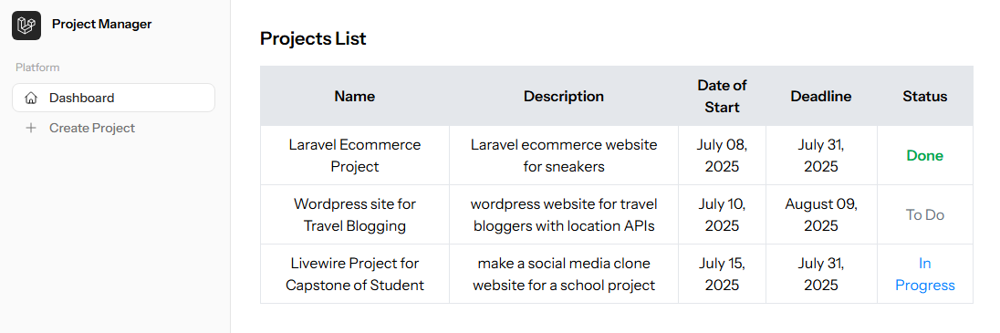
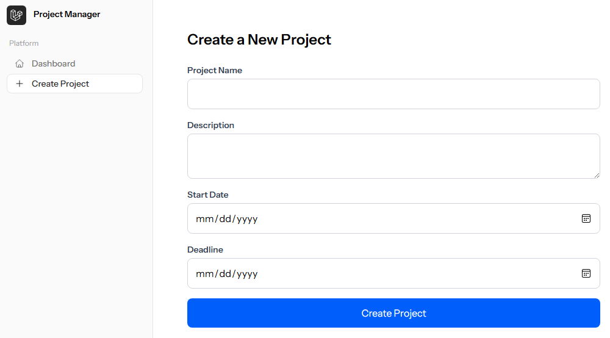

# 🗂️ Laravel Livewire Project Manager

This is a simple Laravel Livewire application that allows users to **create**, **view**, **edit**, and **delete** projects. Each project contains the following fields:

- **Name**
- **Title**
- **Start Date**
- **Deadline**
- **Status** (e.g., pending, in progress, completed)

---

## ⚙️ Requirements

- PHP 8.1+
- Composer
- Laravel 10+
- Livewire 3+
- MySQL/PostgreSQL or SQLite

---

## 🖼️ Screenshots

### Project List View

### Create Project Form

----

## 📦 Features

### ✅ Create a new project

### ✅ Edit an existing project

### ✅ Delete a project with confirmation

### ✅ View list of projects

### ✅ Real-time validation using Livewire

### ✅ Prevent selecting past dates

